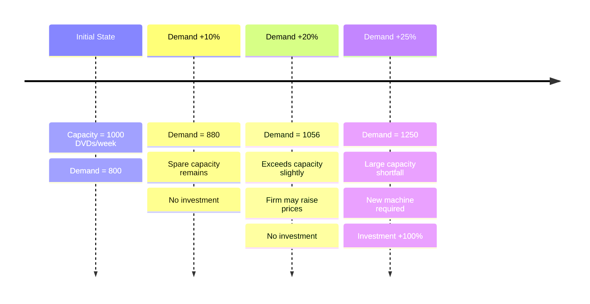

---
Types:
  - 📔 Lecture
Finished: false
base: "[[ETH MacroEco Knowledge.base]]"
---

> [!tldr] Materials
> - 🎦 [Recording](https://video.ethz.ch/lectures/d-mtec/2025/autumn/363-0565-00L/v/PaS4fbEfoxB?t=43m38s)
> - 🎞️ [[2025Lecture10.pdf#page=14&selection=3,0,4,18|2025Lecture10, page 14]]

- Short run in this section
- Keynesian Cross 和 IS–LM 模型中：价格水平 $P$ 被假定为“短期固定（sticky / constant）”，不变。
#  Comparison of Classical Theory and Keynesian Theory
- Classical economics emphasizes the fact that free markets lead to an efficient outcome and are self-regulating.
- In macroeconomics, classical economics assumes the long run aggregate supply curve is inelastic; therefore any deviation from full employment will only be temporary.
- The Classical model stresses the importance of limiting government intervention and striving to keep markets free of potential barriers to their efficient operation.
- Keynesians argue that the economy can be below full capacity for a considerable time due to imperfect markets.
- Keynesians place a greater role for expansionary fiscal policy (government intervention) to overcome recession.

| Feature             | Classical Economics                                                                   | Keynesian Economics                                                                  |
| ------------------- | ------------------------------------------------------------------------------------- | ------------------------------------------------------------------------------------ |
| **View**            | Long run                                                                              | Short run, especially during recessions                                              |
| **Wages**           | Flexible                                                                              | Sticky / rigid                                                                       |
| **Prices**          | Flexible                                                                              | Sticky / rigid                                                                       |
| **Employment**      | Full employment (underemployment is voluntary and temporary)                          | Unemployment and underemployment are possible                                        |
| **Output**          | Supply-determined (Say’s Law: supply creates demand)                                  | Aggregate-demand-determined (demand creates supply; model based on aggregate demand) |
| **Intervention**    | No government intervention                                                            | Government intervention necessary to stabilize the economy                           |
| **Policies**        | No faith in fiscal and monetary policies                                              | Faith in fiscal and monetary policies as stabilization tools                         |
| **Budget**          | Balanced budget                                                                       | Deficit budget                                                                       |
| **Supply curve**    | Vertical                                                                              | Upward sloping                                                                       |
| **Demand curve**    | Downward sloping                                                                      | Downward sloping (straight line)                                                     |
| **Money**           | No intrinsic value; medium of exchange only. Money supply proportional to price level | Has intrinsic value as well as being a medium of exchange                            |
| **Economic system** | Laissez-faire policy; self-adjusting and self-stabilizing                             | Rejects laissez-faire; supports government stabilization measures                    |
| **Credit**          | Saving and investment equilibrate through the interest rate                           | Saving and investment equilibrate through income levels                              |
# Planned and actual spending

# Keynesian cross
[[Economics (Share N. Gregory Mankiw, Mark P. Taylor).pdf#page=630&selection=37,0,42,5|Economics (Share N. Gregory Mankiw, Mark P. Taylor), page 630]]
- In the Keynesian cross diagram, the 45° line connects all points where total spending would be equal to national income: $E=Y$
- 横轴：**National income / Output $Y$**（国民收入/产出）
- 纵轴：**Total expenditure $E$**（总支出/总需求）
- **Planned expenditure** refers to the colored lines. 
- The 45° line represents **actual spending**. 
- The Keynesian cross equates actual with planned expenditure. If the economy is in equilibrium, actual expenditure equals planned expenditure.

- ==Autonomous expenditure==: spending that is not dependent on income/output
    - 不管收入 $Y$ 多高多低，都“先天就会发生”的那部分支出。
    - 支出线 $E(Y)$在纵轴上的[[intercept term]]（当 $Y=0$ 时 $E$ 仍然 $> 0$）。
    - The additional spending that follows as a result of the multiplier effect is termed ==induced expenditure== (not Autonomous expenditure = induced expenditure)
    
| 类型                    | 为什么是 autonomous |
| --------------------- | --------------- |
| 政府支出 $G$              | 预算先定好，不看当期 GDP  |
| 基础消费 $\bar C$         | 再穷也要吃饭          |
| autonomous investment | 企业基于技术 / 预期做决定  |
| export                | 取决于外国收入，不是本国    |

- The ==deflationary or output gap== is the difference between full employment output and expenditure when expenditure is less than full employment output
    - there is insufficient demand to maintain full employment output.
    ![[Screenshot 2026-01-05 at 20.56.49.png|450]]
- The ==inflationary gap== is the difference between full employment output and actual expenditure when actual expenditure is greater than full employment output
    - the economy does not have the capacity to meet demand. 
    - In this case the government needs to shift the $C+I+G+(X-M)_2$ line down
    
    ![[Screenshot 2026-01-05 at 20.57.26.png|450]]
# The Multiplier Effect
- The ==multiplier effect== refers to the additional shifts in aggregate demand that result when expansionary fiscal policy increases income and thereby increases consumer spending
    当**扩张性财政政策**先提高了收入，**由此引发的消费增加**，又会导致**总需求进一步、多轮次地上升**。
- Marginal Propensity to Consume($MPC$): It is the fraction of extra income that a household consumes rather than saves 每多 1 单位收入，有多少比例会被拿去消费，而不是储蓄。
- The slope of the expenditure function is dependent on the multiplier effect
- Any increase in *autonomous expenditure* will lead to a multiplier effect
    ![[Screenshot 2026-01-05 at 22.07.41.png|smaller multiplier|400]]![[Screenshot 2026-01-05 at 22.08.11.png|higher multiplier|400]]

> [!tip]- Visualization
> ```mermaid
> flowchart TD
>     G["Government Spending ↑<br/>+1 €"]:::policy
> 
>     I1["Income ↑<br/>Firms receive +1 €"]:::income
>     C1["Consumption ↑<br/>MPC × income"]:::consumption
> 
>     I2["Income ↑<br/>New income created"]:::income
>     C2["Consumption ↑<br/>Further spending"]:::consumption
> 
>     AD["Aggregate Demand ↑↑<br/>Total increase > 1 €"]:::result
> 
>     %% Main chain (vertical)
>     G --> I1 --> C1 --> I2 --> C2 --> AD
> 
>     %% Multiplier feedback loop (compact)
>     C2 -.->|multiplier| I1
> 
> classDef income fill:#cce5ff,stroke:#004085,stroke-width:2px
> classDef consumption fill:#d4edda,stroke:#155724,stroke-width:2px
> classDef policy fill:#fff3cd,stroke:#856404,stroke-width:2px
> classDef result fill:#f8d7da,stroke:#721c24,stroke-width:2px
> 
> ```

## Formula for Spending Multiplier
$$\text{Multiplier} = \frac{1}{(1 - MPC)} = \frac{1}{MPS}$$
- How to derive the formula: Using **Geometric Series**
- $MPS$ = marginal propensity to save
## Withdrawals ($W$)
> withdrawals 不是乘数的起点，而是乘数过程中的“刹车”
- Savings, imports, and taxes are **endogenous** as they are directly related to changes in income  它们不是“exogenous 外部变化”， 而是 **收入一变，它们自动跟着变**。
- MPW
    - ==MPS==：marginal propensity to save  
        → 多 1 块收入，存多少
    - ==MPT==：marginal propensity to tax  
        → 多 1 块收入，交税多少
    - ==MPM==：marginal propensity to import  
        → 多 1 块收入，用于进口多少
    
    $$\text{MPW} = \text{MPS} + \text{MPT} + \text{MPM}$$
    - The MPW will reduce the size of the multiplier

$$\text{Multiplier}
= \frac{1}{\text{MPS} + \text{MPT} + \text{MPM}}
= \frac{1}{\text{MPW}}$$

$$Y=C+I+G+X-M \Leftrightarrow (Y-C-T) + T + M = I + G + X$$

# The Accelerator Principle
The accelerator principle relates the rate of change of demand to the rate of change in investment
- Demand持续、快速上升 → Investment会跳跃式增长

**Example**
- Suppose a machine can produce 1,000 DVDs per week. Current demand is 800 DVDs per week
- A 10% rise in demand can be accommodated with no new investment in machinery
- Suppose the following year demand rises by 20%, taking demand to 1,056 units
- The firm may decide against(not) investing in new capacity and raise prices in face of the shortage
- But if demand rises by 25% the firm is very likely to invest in a new machine 
- An increase in demand of 25% has led to an ‘accelerated’ rise in investment of 100%



# IS-LM
- IS: good and service market and loanable funds market 在给定利率下，使商品市场（goods market）达到均衡的所有产出水平
- LM: money market (Liquidity and Money)
The IS-LM model, standing for "investment-saving" (IS) and "liquidity preference-money supply" (LM), is a foundational Keynesian [macroeconomic](https://www.investopedia.com/terms/m/macroeconomics.asp) concept. It illustrates the interaction between the goods market and the [money market](https://www.investopedia.com/terms/m/moneymarket.asp), using IS and LM curves to determine the short-run equilibrium of [interest rates](https://www.investopedia.com/terms/i/interestrate.asp) and output.
IS–LM 模型是用来回答这一件事的：  在“短期价格不变”的前提下，  经济最终会停在什么【Output $Y$】和【Interest Rate $r$】上？  财政政策和货币政策到底有没有用、怎么起作用？

## The IS Curve
- The IS curve shows an inverse relationship between the interest rate and output. i.e. 在每一个利率水平下，使“商品市场达到均衡($E=Y$)”的产出水平。
    - **也就是每个点都是good and service market 均衡的情况**
- The slope of the IS curve depends on how responsive consumption($C$) and investment($I$) are to interest rates and on the size of the multiplier.
    - The more responsive are $C$ and $I$ -> the flatter is the IS curve.
    - multiplier越大 -> 同样的$I$变化 -> 产出变化更大  -> IS 更平
### Derive IS from [[#Keynesian cross]] or [[5 Saving, investment and the financial system#^close-market-for-loanable-funds|loanable funds market]]
- The IS curve is derived from the Keynesian cross diagram
    - A fall in the interest rate raises the expenditure line and a new equilibrium occurs at point $b$
        - So every point at IS curve is $E=Y$ i.e. 商品市场达到均衡
    
        ![[Screenshot 2026-01-06 at 18.20.19.png|500]]
- The IS curve can also be derived from the loanable funds market perspective
    $Y$ 变 → $S$ 变 → 清市场所需的 $r$ 变 → 得到 $Y$ 与 $r$ 的负相关。
    ![[Screenshot 2026-01-06 at 18.22.15.png]]
### Shifts in the IS curve 
只有“autonomous expenditure 的变化”才会导致 IS 曲线整体 shift。Shifts in the IS curve come about as a result of changes in autonomous expenditure.
- **A rise in government spending($G$), independent of any change in interest rates, would lead to a shift of the IS curve to the right.**
    - Keynesian-cross perspective
    - Loanable-market perspective
        - For a given level of income ($Y_a$), an increase of $G$ leads to lower national savings
        
    ![[Screenshot 2026-01-06 at 18.46.23.png]]
- **A fall in exports would lead to a shift of the IS curve to the left.**

## The LM Curve 
The LM curve shows income and interest rates where money supply equals liquidity demand. The LM curve slopes up because higher income boosts money demand, needing higher interest rates for balance.
- **也就是每个点都是money market 均衡的情况**
- L = Money demand, Liquidity
- M = Supply

$$\frac{M}{P} = L(Y, i)$$

The LM curve is derived from our money market diagram
- A rise in national income increases the demand for money and a new equilibrium occurs at point $b$
- Positive slope indicates that an increase in income is associated with an increase in the interest rate
- **The LM curve shifts to the right/left if the central bank expands/contracts money supply**
![[Screenshot 2026-01-06 at 19.33.56.png]]
### Shifts in the LM curve: Changing money supply
If the central bank increases money supply from $M_a$ to $M_b$, then (for a given money demand) the interest rate has to fall. 
In the LM diagram this implies that the LM curve shift downward (or to the right). For the same level of income (Y), the interest rate will now be lower.
![[Screenshot 2026-01-06 at 20.10.13.png]]

## General Equilibrium
- Every point on IS curve represents a point of equilibrium in the goods market
- Every point on LM represents a point of equilibrium in the money market
- So a point that lies on both curves represents equilibrium in both the goods market and the money market (IS ∩ LM)
## The Effect of a Change in Fiscal Policy
government chooses to increase its spending to boost economic activity → IS shift to the right
- 在任何给定利率 $i$ 下，
    - 政府支出 $G$ ↑
    - 计划支出 $E$ ↑
    - 均衡产出 $Y$ ↑
- IS 右移 → 经济更“热”
- 收入 ↑ → 货币需求 ↑
- 但 **货币供给没变**
- ⇒ 只能靠 **利率上升** 来压住货币需求
## The Effect of a Change in Monetary Policy
The central bank decides to expand the money supply → The LM curve will shift to the right
## Policy Coordination in Fiscal and Monetary Policy
1. 政府先动
    - **减税 / 增支**
    - ⇒ **IS 右移**
    - ⇒ $Y$↑,$i$↑
2. 央行在“盯着看”,央行会想如果利率上升太多，会不会:
    - 抑制投资？
    - 产生金融压力？
    - 加剧通胀风险？
    
    So,
    - 扩大货币供给
    - ⇒ LM 右移
    - ⇒ 把利率拉回去

![[Screenshot 2026-01-06 at 21.49.37.png|450]]

# The Liquidity Trap 
#review 
When the nominal interest rate is zero, and people have enough money for transaction purposes, they become indifferent between holding money and holding bonds as the return is the same (i.e. 0)
- The demand for money becomes horizontal
- Increases in money supply do not effect the nominal interest rate
![[Screenshot 2026-01-06 at 22.07.26.png|300]]
![[Screenshot 2026-01-06 at 22.09.58.png|450]]
# From IS-LM to Aggregate Demand
so far assumed prices to be stable/constant/sticky -> $P$ was fixed
Now we want to talk about AD, y-axis of AD is Price Level ($P$)
A rise in $P$ causes a fall in $M/P$, shifting the LM curve to the left

![[Screenshot 2026-01-06 at 22.24.43.png|lower left plot is real money market]]

Now, if we want to change the representation of real money market to nominal money market:

![[Screenshot 2026-01-06 at 22.31.03.png|350]]
## A Government Tightening Fiscal Policy
![[Screenshot 2026-01-06 at 22.34.42.png]]
## Central Bank Loosens Monetary Policy
![[Screenshot 2026-01-06 at 22.34.57.png]]